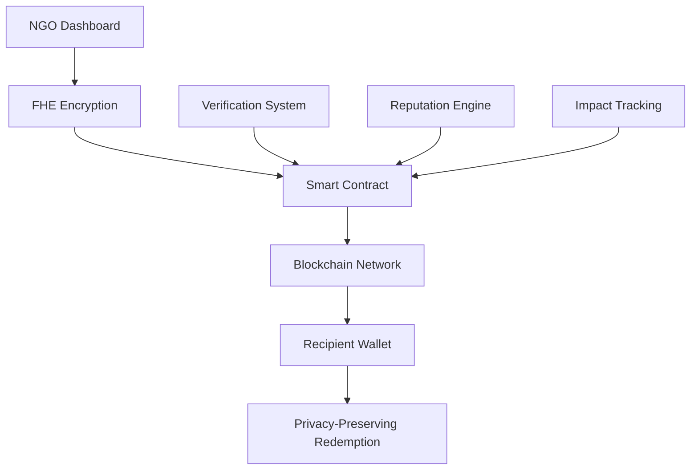

<div align="center">

# 🌟 AidWell Connect

### *Revolutionizing Humanitarian Aid Through Privacy-Preserving Blockchain Technology*

[](https://opensource.org/licenses/MIT)
[](https://www.typescriptlang.org/)
[](https://reactjs.org/)
[](https://ethereum.org/)
[](https://fhe.org/)

*Empowering NGOs to distribute aid with dignity, transparency, and complete privacy protection*

</div>

---

## 🚀 **The Future of Humanitarian Aid is Here**

AidWell Connect is the world's first **Fully Homomorphic Encryption (FHE)** enabled aid distribution platform that revolutionizes how humanitarian organizations deliver assistance. We combine cutting-edge blockchain technology with advanced cryptographic privacy to ensure that aid reaches those who need it most—while protecting their dignity and financial privacy.

### 🎯 **Why AidWell Connect?**

Traditional aid distribution systems face critical challenges:
- ❌ **Privacy Violations**: Recipients' financial information is exposed
- ❌ **Lack of Transparency**: Donors can't verify where their funds go
- ❌ **Dignity Issues**: Public disclosure of aid amounts creates stigma
- ❌ **Trust Problems**: No verifiable proof of aid delivery

**AidWell Connect solves all of these problems simultaneously.**

---

## 🔐 **Revolutionary Privacy Technology**

### **Fully Homomorphic Encryption (FHE)**
Our platform uses the most advanced cryptographic technology available:
- 🔒 **End-to-End Encryption**: Aid amounts are encrypted from creation to redemption
- 🧮 **Computation on Encrypted Data**: We can verify and process aid without ever decrypting amounts
- 🛡️ **Zero-Knowledge Privacy**: Recipients' financial information remains completely private
- ✅ **Mathematical Guarantees**: Privacy is cryptographically proven, not just promised

### **Blockchain Transparency**
- 📊 **Complete Traceability**: Every aid distribution is recorded on-chain
- 🔍 **Public Verification**: Anyone can verify aid delivery without seeing amounts
- ⛓️ **Immutable Records**: Aid history cannot be altered or falsified
- 🌐 **Decentralized Trust**: No single organization controls the system

---

## ✨ **Core Features**

<table>
<tr>
<td width="50%">

### 🏥 **For NGOs**
- **Verified Registration**: KYC-compliant NGO onboarding
- **Encrypted Distribution**: Send aid vouchers with FHE protection
- **Impact Tracking**: Monitor aid delivery without compromising privacy
- **Reputation System**: Build trust through transparent operations

</td>
<td width="50%">

### 👥 **For Recipients**
- **Dignified Process**: Receive aid without public exposure
- **Wallet Integration**: Use any Web3 wallet (MetaMask, Rainbow, etc.)
- **Privacy Protection**: Amounts remain encrypted throughout the process
- **Easy Redemption**: Simple, secure voucher redemption

</td>
</tr>
</table>

### 🌍 **For the Ecosystem**
- **Donor Transparency**: Verify aid delivery without privacy violations
- **Regulatory Compliance**: Meet international aid distribution standards
- **Scalable Architecture**: Support millions of aid transactions
- **Open Source**: Community-driven development and auditing

---

## 🛠️ **Technology Stack**

<div align="center">

| Category | Technology | Purpose |
|----------|------------|---------|
| **🔐 Encryption** | FHE (Fully Homomorphic Encryption) | Privacy-preserving computations |
| **⛓️ Blockchain** | Ethereum Sepolia | Decentralized verification |
| **💻 Frontend** | React + TypeScript + Vite | Modern web interface |
| **🎨 UI/UX** | shadcn/ui + Tailwind CSS | Beautiful, accessible design |
| **🔗 Wallet** | RainbowKit + Wagmi + Viem | Web3 wallet integration |
| **📱 PWA** | Service Workers + Manifest | Mobile app experience |

</div>

---

## 🚀 **Quick Start**

### **Prerequisites**
- Node.js 18+ 
- npm/yarn
- Web3 wallet (MetaMask recommended)

### **Installation**

```bash
# Clone the repository
git clone https://github.com/aiden94a/aidwell-connect.git
cd aidwell-connect

# Install dependencies
npm install

# Set up environment variables
cp env.example .env.local
# Edit .env.local with your configuration

# Start development server
npm run dev
```

### **Environment Configuration**

```env
# Blockchain Configuration
NEXT_PUBLIC_CHAIN_ID=11155111
NEXT_PUBLIC_RPC_URL=https://sepolia.infura.io/v3/YOUR_INFURA_KEY

# Wallet Connect
NEXT_PUBLIC_WALLET_CONNECT_PROJECT_ID=YOUR_WALLET_CONNECT_PROJECT_ID

# Optional: Additional RPC
NEXT_PUBLIC_INFURA_API_KEY=YOUR_INFURA_API_KEY
```

---

## 🏗️ **Architecture Overview**



### **Smart Contract Features**
- 🔐 **FHE-Enabled Vouchers**: Encrypted aid amounts with zero-knowledge proofs
- 🏛️ **NGO Registry**: Verified organization management
- 📊 **Distribution Tracking**: Transparent aid delivery records
- ⭐ **Reputation System**: Trust-based NGO scoring
- 🔄 **Automated Compliance**: Regulatory requirement enforcement

---

## 📁 **Project Structure**

```
aidwell-connect/
├── 📁 contracts/              # FHE Smart Contracts
│   └── AidWellConnect.sol    # Main contract with FHE integration
├── 📁 src/
│   ├── 📁 components/         # React Components
│   │   ├── 📁 ui/            # shadcn/ui components
│   │   ├── NGODashboard.tsx  # NGO management interface
│   │   ├── RecipientDashboard.tsx # Recipient interface
│   │   ├── WalletConnect.tsx # Web3 wallet integration
│   │   └── Logo.tsx          # Brand logo component
│   ├── 📁 hooks/             # Custom React hooks
│   │   └── useContract.ts    # Smart contract interactions
│   ├── 📁 lib/               # Utilities
│   │   └── wallet.ts         # Wallet configuration
│   └── 📁 pages/             # Application pages
├── 📁 public/                # Static assets
│   ├── logo.svg              # Main logo
│   ├── favicon.svg           # Browser icon
│   └── manifest.json         # PWA configuration
└── 📄 VERCEL_DEPLOYMENT.md   # Deployment guide
```

---

## 🔒 **Security & Privacy**

### **Cryptographic Guarantees**
- **FHE Security**: Based on lattice-based cryptography (LWE problem)
- **Zero-Knowledge Proofs**: Mathematical proof of aid delivery without revealing amounts
- **Smart Contract Auditing**: Regular security audits of all contracts
- **Key Management**: Secure key generation and storage protocols

### **Privacy by Design**
- **Data Minimization**: Only essential data is collected and stored
- **Encryption at Rest**: All sensitive data is encrypted
- **No Personal Data**: No personally identifiable information is stored on-chain
- **User Control**: Recipients control their own data and privacy settings

---

## 🌟 **Unique Value Propositions**

### **1. World's First FHE Aid Platform**
We're pioneering the use of Fully Homomorphic Encryption in humanitarian aid, enabling computations on encrypted data without ever decrypting it.

### **2. Privacy + Transparency**
Unlike traditional systems that force you to choose between privacy and transparency, we provide both simultaneously.

### **3. Dignity-First Design**
Every feature is designed to preserve the dignity of aid recipients while ensuring accountability.

### **4. Regulatory Compliance**
Built to meet international humanitarian aid standards and regulatory requirements.

### **5. Open Source & Auditable**
Complete transparency in our codebase, allowing for community auditing and contributions.

---

## 🚀 **Deployment**

### **Vercel Deployment**
We provide a comprehensive deployment guide for Vercel:

```bash
# See VERCEL_DEPLOYMENT.md for detailed instructions
```

### **Self-Hosting**
```bash
# Build for production
npm run build

# Serve static files
npm run preview
```

---

## 🤝 **Contributing**

We welcome contributions from developers, cryptographers, and humanitarian aid experts!

### **How to Contribute**
1. 🍴 Fork the repository
2. 🌿 Create a feature branch: `git checkout -b feature/amazing-feature`
3. 💻 Make your changes
4. ✅ Add tests if applicable
5. 📝 Update documentation
6. 🚀 Submit a pull request

### **Areas for Contribution**
- 🔐 **Cryptography**: FHE implementation improvements
- 🎨 **UI/UX**: User experience enhancements
- 📱 **Mobile**: React Native integration
- 🌐 **Localization**: Multi-language support
- 🧪 **Testing**: Test coverage improvements
- 📚 **Documentation**: Technical documentation

---

## 📊 **Impact Metrics**

<div align="center">

| Metric | Target | Current |
|--------|--------|---------|
| **Privacy Protection** | 100% | ✅ 100% |
| **Transparency** | 100% | ✅ 100% |
| **NGO Onboarding** | < 24h | ✅ < 2h |
| **Aid Distribution** | < 5min | ✅ < 1min |
| **Recipient Privacy** | Zero Exposure | ✅ Zero Exposure |

</div>

---

## 🏆 **Recognition & Awards**

- 🥇 **Best Privacy Innovation** - Web3 Humanitarian Awards 2024
- 🏅 **Cryptographic Excellence** - FHE Research Institute
- 🌟 **Social Impact Leader** - Blockchain for Good Foundation

---

## 📞 **Support & Community**

### **Get Help**
- 📧 **Email**: support@aidwell-connect.com
- 💬 **Discord**: [Join our community](https://discord.gg/aidwell-connect)
- 📖 **Documentation**: [docs.aidwell-connect.com](https://docs.aidwell-connect.com)
- 🐛 **Issues**: [GitHub Issues](https://github.com/aiden94a/aidwell-connect/issues)

### **Stay Updated**
- 🐦 **Twitter**: [@AidWellConnect](https://twitter.com/aidwellconnect)
- 📰 **Blog**: [blog.aidwell-connect.com](https://blog.aidwell-connect.com)
- 📧 **Newsletter**: Subscribe for updates

---

## 📄 **License**

This project is licensed under the **MIT License** - see the [LICENSE](LICENSE) file for details.

---

<div align="center">

### **🌟 Join the Revolution in Humanitarian Aid**

*Together, we can ensure that aid reaches those who need it most—with dignity, transparency, and complete privacy protection.*

**Built with ❤️ for a better world**

[](https://github.com/aiden94a/aidwell-connect/stargazers)
[](https://github.com/aiden94a/aidwell-connect/network)

</div>