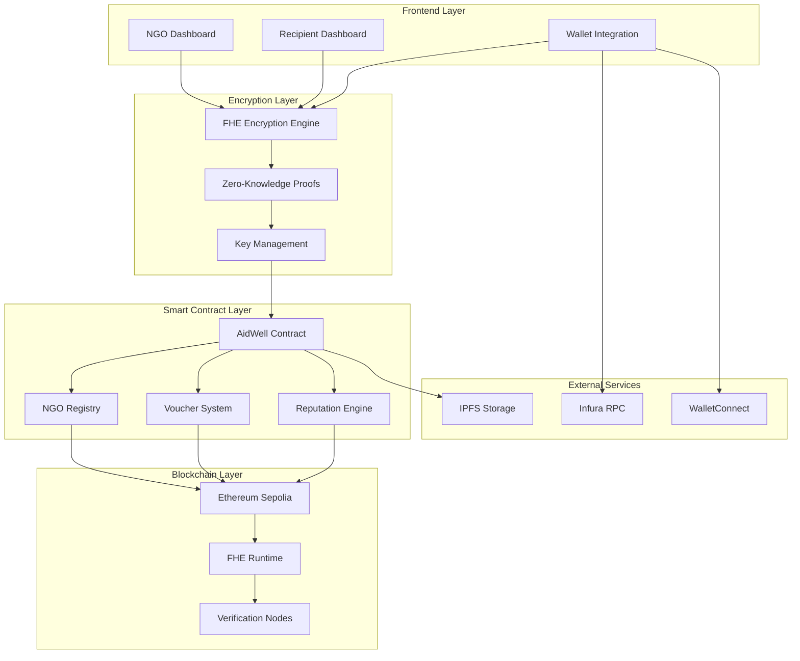
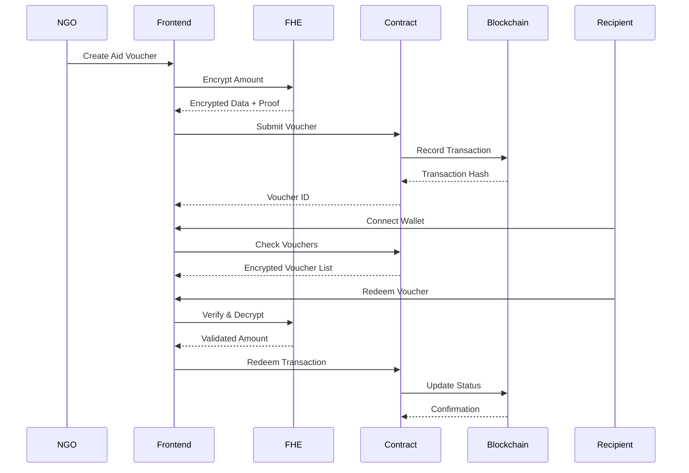
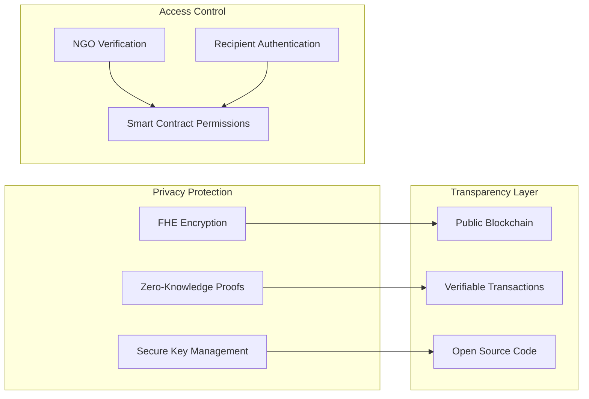
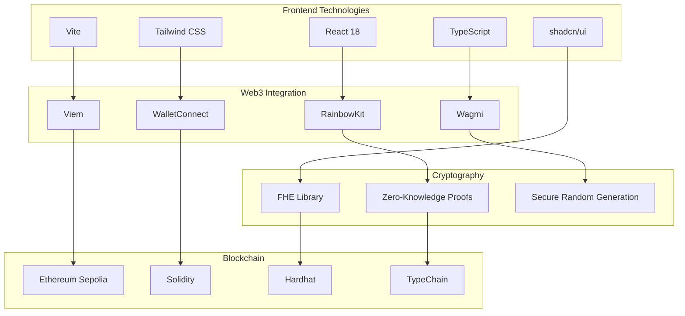

# AidWell Connect Architecture

## System Architecture Diagram

```mermaid
graph TB
    subgraph "Frontend Layer"
        A[NGO Dashboard] 
        B[Recipient Dashboard]
        C[Wallet Integration]
    end
    
    subgraph "Encryption Layer"
        D[FHE Encryption Engine]
        E[Zero-Knowledge Proofs]
        F[Key Management]
    end
    
    subgraph "Smart Contract Layer"
        G[AidWell Contract]
        H[NGO Registry]
        I[Voucher System]
        J[Reputation Engine]
    end
    
    subgraph "Blockchain Layer"
        K[Ethereum Sepolia]
        L[FHE Runtime]
        M[Verification Nodes]
    end
    
    subgraph "External Services"
        N[Infura RPC]
        O[WalletConnect]
        P[IPFS Storage]
    end
    
    A --> D
    B --> D
    C --> D
    D --> E
    E --> F
    F --> G
    G --> H
    G --> I
    G --> J
    H --> K
    I --> K
    J --> K
    K --> L
    L --> M
    C --> N
    C --> O
    G --> P
```

## Data Flow Diagram

```mermaid
sequenceDiagram
    participant NGO
    participant Frontend
    participant FHE
    participant Contract
    participant Blockchain
    participant Recipient
    
    NGO->>Frontend: Create Aid Voucher
    Frontend->>FHE: Encrypt Amount
    FHE-->>Frontend: Encrypted Data + Proof
    Frontend->>Contract: Submit Voucher
    Contract->>Blockchain: Record Transaction
    Blockchain-->>Contract: Transaction Hash
    Contract-->>Frontend: Voucher ID
    
    Recipient->>Frontend: Connect Wallet
    Frontend->>Contract: Check Vouchers
    Contract-->>Frontend: Encrypted Voucher List
    Recipient->>Frontend: Redeem Voucher
    Frontend->>FHE: Verify & Decrypt
    FHE-->>Frontend: Validated Amount
    Frontend->>Contract: Redeem Transaction
    Contract->>Blockchain: Update Status
    Blockchain-->>Contract: Confirmation
```

## Security Model

```mermaid
graph LR
    subgraph "Privacy Protection"
        A[FHE Encryption]
        B[Zero-Knowledge Proofs]
        C[Secure Key Management]
    end
    
    subgraph "Transparency Layer"
        D[Public Blockchain]
        E[Verifiable Transactions]
        F[Open Source Code]
    end
    
    subgraph "Access Control"
        G[NGO Verification]
        H[Recipient Authentication]
        I[Smart Contract Permissions]
    end
    
    A --> D
    B --> E
    C --> F
    G --> I
    H --> I
```

## Technology Stack

```mermaid
graph TB
    subgraph "Frontend Technologies"
        A[React 18]
        B[TypeScript]
        C[Vite]
        D[Tailwind CSS]
        E[shadcn/ui]
    end
    
    subgraph "Web3 Integration"
        F[RainbowKit]
        G[Wagmi]
        H[Viem]
        I[WalletConnect]
    end
    
    subgraph "Cryptography"
        J[FHE Library]
        K[Zero-Knowledge Proofs]
        L[Secure Random Generation]
    end
    
    subgraph "Blockchain"
        M[Ethereum Sepolia]
        N[Solidity]
        O[Hardhat]
        P[TypeChain]
    end
    
    A --> F
    B --> G
    C --> H
    D --> I
    E --> J
    F --> K
    G --> L
    H --> M
    I --> N
    J --> O
    K --> P
```
